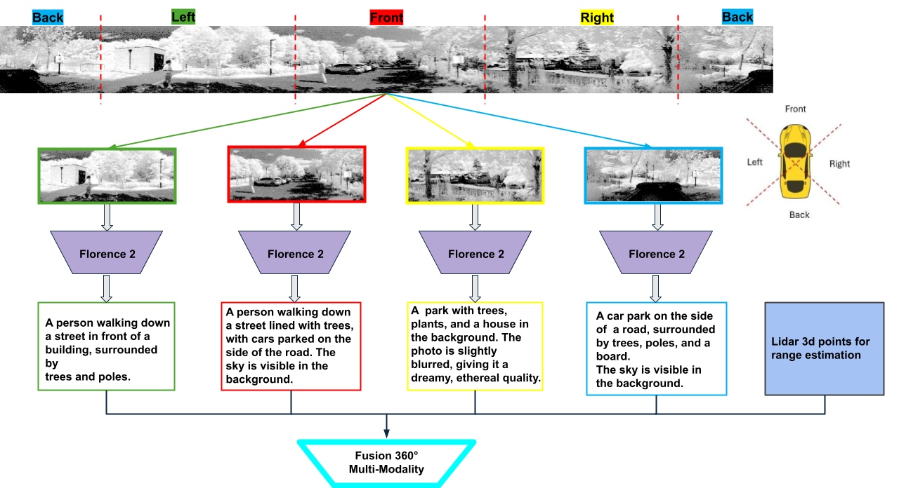

# TexLidar  
[[Paper]]()

TexLidar is a deep-learning-based tool for extracting text and detecting objects from ambient images. It utilizes Microsoft's Florence-2 model to analyze images, process captions, and identify objects within different sections of an image.  

## Approach



## Features  

- **Caption Generation**: Splits an image into four sections (left, front, right, back) and generates descriptive captions.  
- **Object Detection**: Detects objects in each section, adjusts ROIs to full-image coordinates, and overlays bounding boxes.  
- **Automatic Image Processing**: Handles grayscale and 16-bit images, converting them for optimal model compatibility.  

## Installation

### Prerequisites  
- Python 3.8+  
- PyTorch (with CUDA support if using GPU)  
- Transformers (Hugging Face)  
- NumPy  
- PIL (Pillow)  
- Matplotlib  

### Install Dependencies  
#### 1. Create and activate a Conda environment (optional but recommended):  
```bash
conda create -n TexLiDAR python=3.10
conda activate TexLiDAR
```

#### 2. Install PyTorch (with CUDA 11.8 support):  
```bash
pip3 install torch torchvision torchaudio --index-url https://download.pytorch.org/whl/cu118
 Note: The CUDA version depends on the hardware. Ensure that the version of CUDA you install is compatible with your GPU.
 You can refer to https://pytorch.org/get-started/locally/ to find the correct installation command for your system and CUDA version.
```


#### 3. Install remaining dependencies:  
```bash
pip install -r requirements.txt
```

### Verify Installation  
Run the following command to check if PyTorch and CUDA are properly installed:  
```python
import torch
print("Torch version:", torch.__version__)
print("CUDA available:", torch.cuda.is_available())
```
If `CUDA available: False`, ensure that you have installed the correct CUDA version and drivers.
```

## Usage  

### 1. Caption Generation  
Run the `Caption.py` script to generate a caption for an image:  
```bash
python Caption.py --image_path path/to/image.png
```
This will split the image into sections, generate captions for each part, and merge them into a final caption.  

### 2. Object Detection  
Run the `object_detection.py` script to detect objects and overlay bounding boxes:  
```bash
python object_detection.py --image_path path/to/image.png
```
This will analyze the image sections, detect objects, and display the full image with bounding boxes.  

## Project Structure  

```
TexLidar/
│── Caption.py               # Generates captions for image sections
│── object_detection.py                     # Performs object detection and overlays results
│── utils.py                 # Utility functions for image processing and LiDAR handling
│── config.py                # Configuration file for constants like image size
│── calculate_distance.py    # Processes LiDAR data and visualizes distance, height, and intensity maps
│── README.md                # Project documentation
│── requirements.txt         # List of dependencies for the project
```

## Dataset

The TexLidar project uses the **DurLAR** dataset . It is available at the following GitHub repository:

[DurLAR Dataset](https://github.com/l1997i/DurLAR)

You can access and download the dataset from the provided link.

## Contribution  

Contributions are welcome! If you'd like to improve TexLidar, please open an issue or submit a pull request.  

## License  

This project is licensed under the MIT License.  

